<div align="center">


**Futureboard Studio Community Edition — an open-source digital audio workstation, built natively in Rust on GPUI.**

[](https://github.com/futureboard/Futureboard/actions/workflows/ci.yml)
[](ARCHITECTURE.md)
[](LICENSE)
[](CONTRIBUTING.md)
[](https://crowdin.com/project/futureboard-studio)

[](https://rustup.rs)
[](https://www.gpui.rs)
[](#features)
[](#platform-notes)

[Screenshots](#screenshots) ·
[Features](#features) ·
[Getting Started](#getting-started) ·
[Build & Package](#build--package) ·
[Architecture](#architecture) ·
[Debugging](#debugging--diagnostics) ·
[Translations](#translations) ·
[Contributing](#contributing)

</div>

<p align="center">
  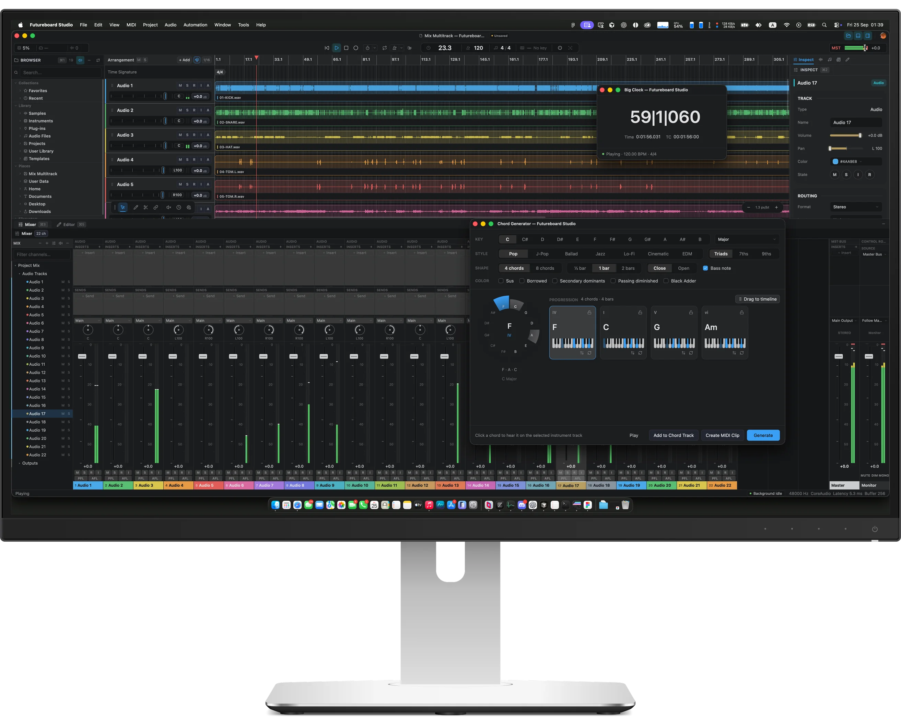
</p>

> [!WARNING]
> **Pre-alpha.** Futureboard Studio is under active early development. Expect
> breaking changes, missing features and project-format revisions. Do not trust
> it with irreplaceable work; nightly builds are test snapshots only.

---

## Screenshots

<table>
  <tr>
    <td colspan="2" align="center">
      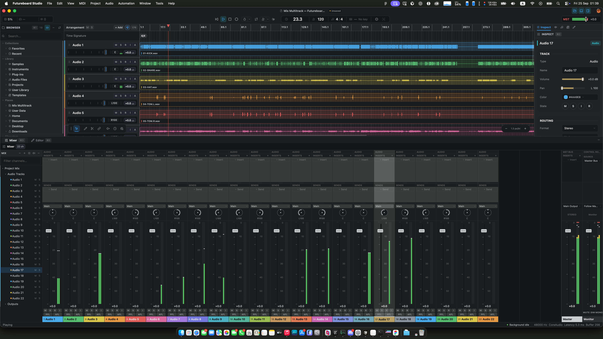
      <br />
      <sub>Workspace — arrangement, browser, inspector and the docked mixer</sub>
    </td>
  </tr>
  <tr>
    <td width="50%" align="center">
      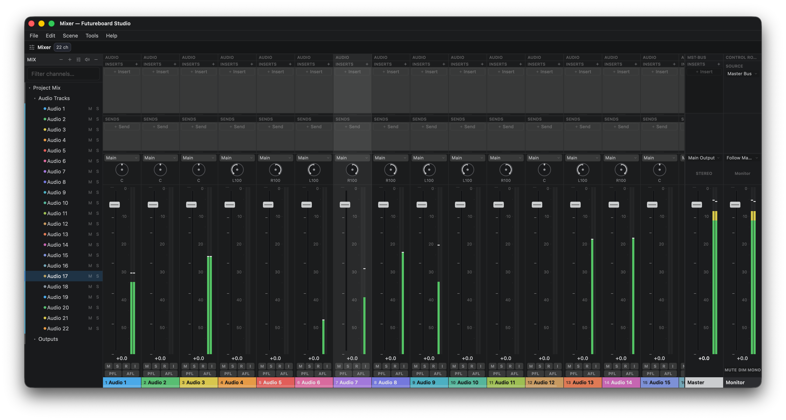
      <br />
      <sub>Mixer — inserts, sends, pan, PFL/AFL, Master and Monitor</sub>
    </td>
    <td width="50%" align="center">
      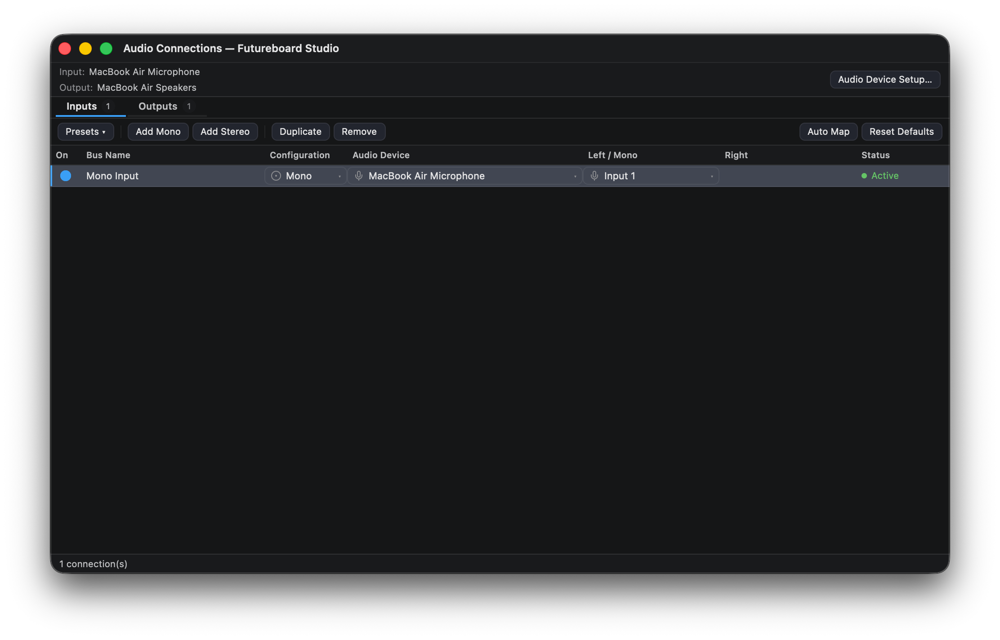
      <br />
      <sub>Audio Connections — named input and output buses</sub>
    </td>
  </tr>
  <tr>
    <td width="50%" align="center">
      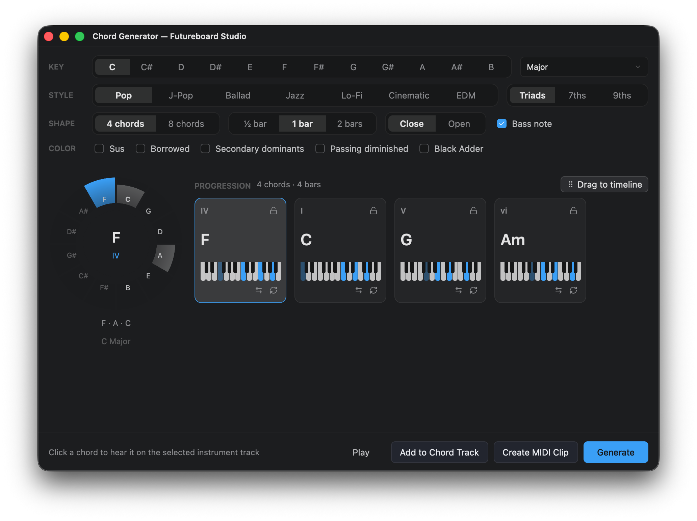
      <br />
      <sub>Chord Generator — progressions to a Chord Track or MIDI clip</sub>
    </td>
    <td width="50%" align="center">
      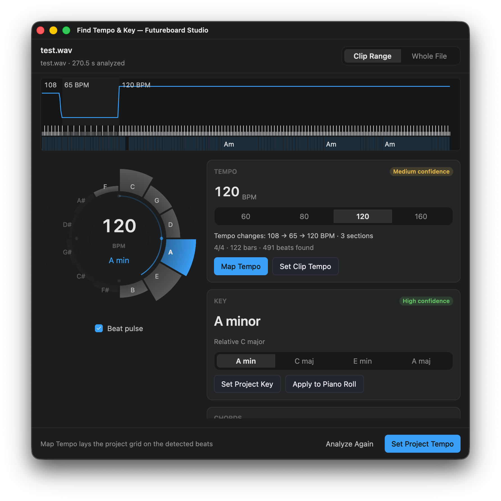
      <br />
      <sub>Find Tempo &amp; Key — tempo map, key and chords from audio</sub>
    </td>
  </tr>
  <tr>
    <td width="50%" align="center">
      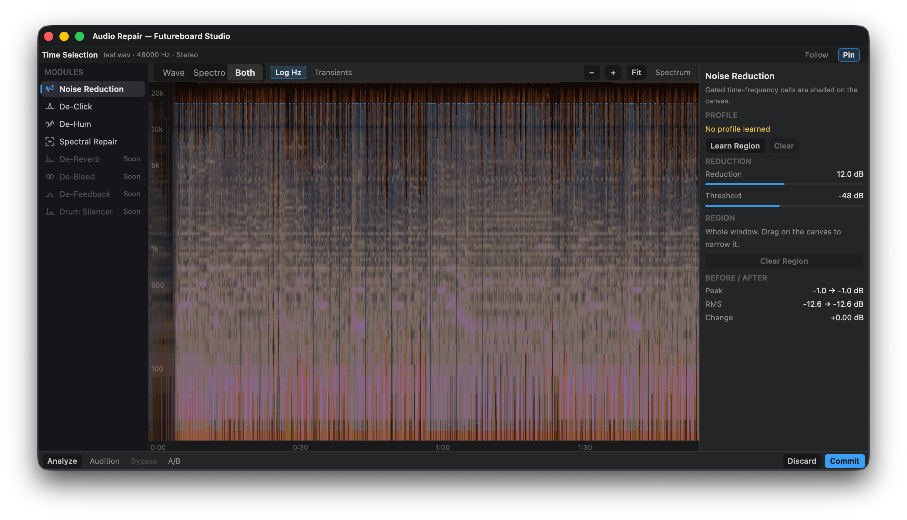
      <br />
      <sub>Audio Repair — noise reduction, de-click, de-hum, spectral repair</sub>
    </td>
    <td width="50%" align="center">
      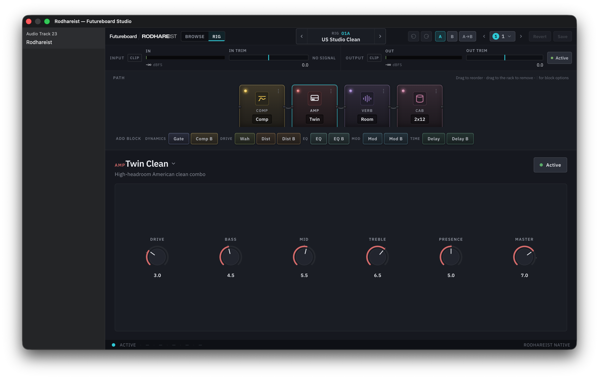
      <br />
      <sub>Rodhareist — a built-in amp and effects rig</sub>
    </td>
  </tr>
  <tr>
    <td width="50%" align="center">
      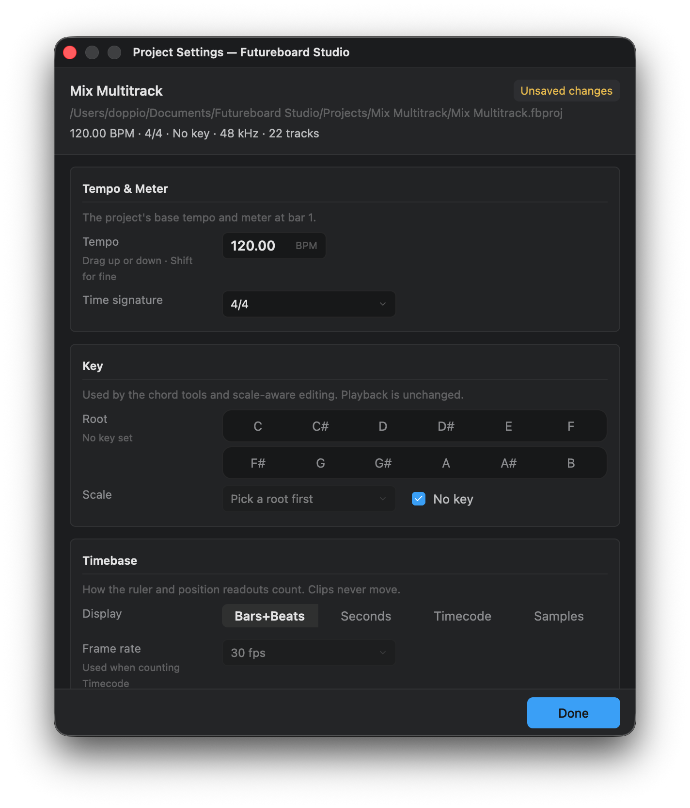
      <br />
      <sub>Project Settings — tempo, meter, key and timebase</sub>
    </td>
    <td width="50%" align="center">
      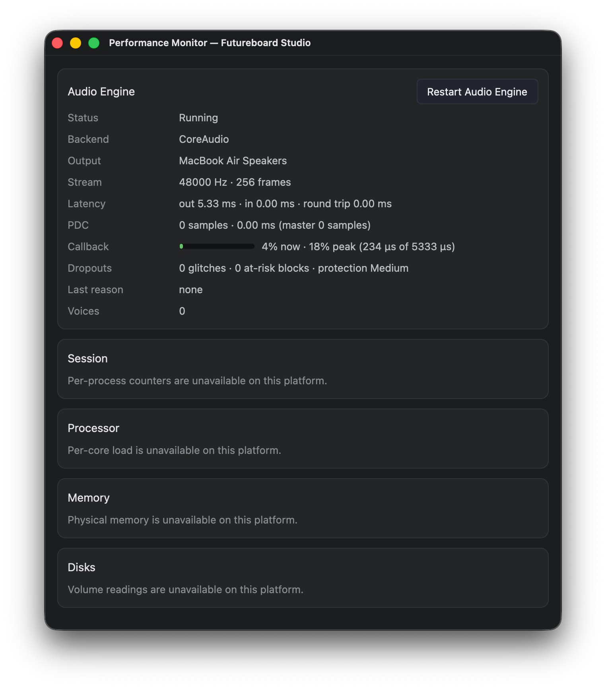
      <br />
      <sub>Performance Monitor — engine status, callback load, dropouts</sub>
    </td>
  </tr>
  <tr>
    <td width="50%" align="center">
      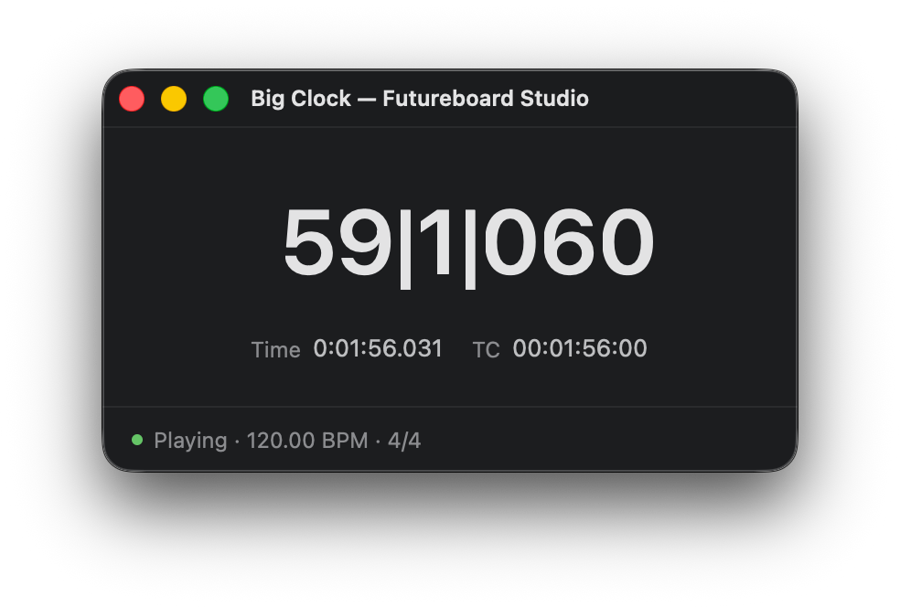
      <br />
      <sub>Big Clock — bars|beats|ticks, time and timecode</sub>
    </td>
    <td width="50%" align="center">
      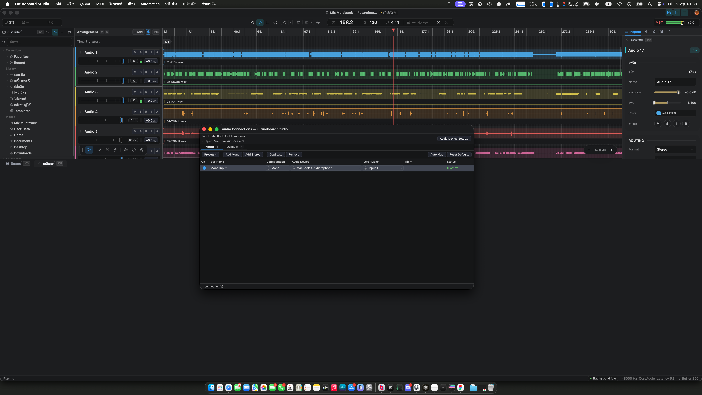
      <br />
      <sub>Utility windows float over the workspace</sub>
    </td>
  </tr>
</table>

<details>
<summary><b>Localized interface (Thai)</b></summary>
<br />
<table>
  <tr>
    <td colspan="2" align="center">
      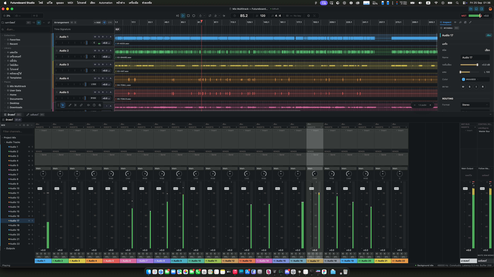
      <br />
      <sub>Workspace</sub>
    </td>
  </tr>
  <tr>
    <td width="50%" align="center">
      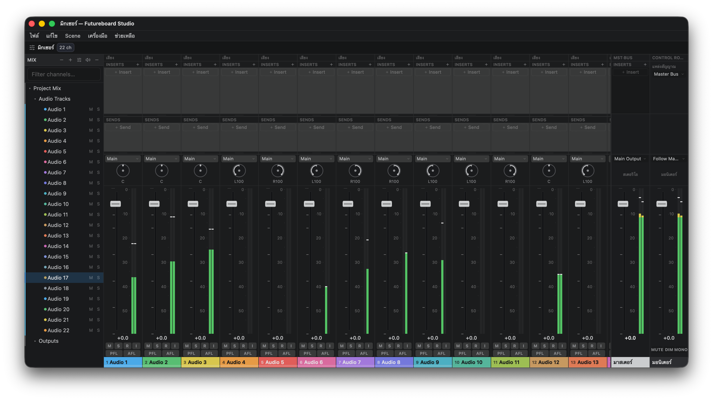
      <br />
      <sub>Mixer</sub>
    </td>
    <td width="50%" align="center">
      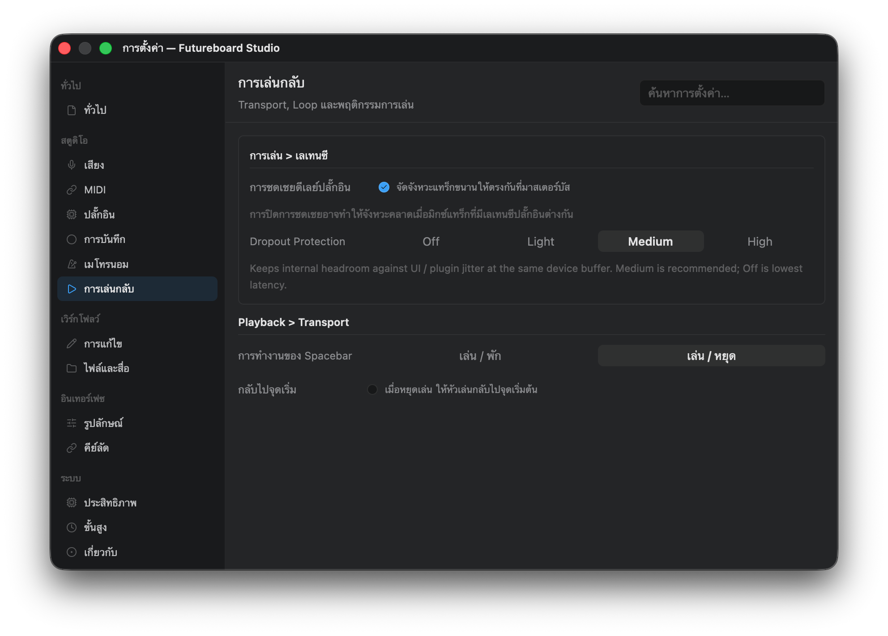
      <br />
      <sub>Settings</sub>
    </td>
  </tr>
</table>
</details>

---

## Features

Futureboard Studio is one native desktop application: the shell, the editors,
the audio engine and the plug-in host are Rust. What exists today, pre-alpha:

- **Arrangement** — audio, MIDI, instrument, bus, return and folder tracks;
  clips, takes, markers, regions, tempo and time-signature tracks, automation
  lanes, and a Chord Track.
- **Editing** — piano roll with per-note MIDI channels and controller lanes, an
  audio editor with time-stretch and pitch, and a spectrogram view.
- **Mixer** — inserts, sends, bus and return routing, pan, mute/solo, PFL/AFL
  listen, plug-in delay compensation, a Master bus and a Control Room monitor
  path. Docked or in its own window.
- **Audio Connections** — named mono and stereo input and output buses mapped
  onto the audio device's channels.
- **Plug-in hosting** — VST3, CLAP, AU (macOS) and legacy VST2, scanned and
  run out of process, with native editor embedding and ARA 2 support.
- **Built-in instruments and effects** — see [Built-in plug-ins](#built-in-plug-ins).
- **Built-in Soundfont Player** — any `.sf2`, as one instrument or as sixteen
  parts on the MIDI channels, General MIDI style.
- **Music tools** — Chord Generator, Find Tempo &amp; Key, stem extraction and
  audio repair (noise reduction, de-click, de-hum, spectral repair).
- **Utility windows** — Big Clock, Performance Monitor, master-bus visualizers
  (spectrum, stereo image, loudness, oscilloscope, spectrogram), Virtual
  Keyboard, Project Settings.
- **Localization** — English, Thai, Japanese, Simplified Chinese and Lao
  catalogs, with composite fonts for mixed scripts.

### Built-in plug-ins

Built-in plug-ins are Rust DSP hosted by the plug-in host. Each has its own
editor, a compiled web view embedded in the binary — the one place Futureboard
uses web technology.

| Kind        | Plug-ins                                                                   |
| ----------- | -------------------------------------------------------------------------- |
| Dynamics    | Compressor (single and multiband) · FA-2A · FA-76 · Z-Comp · Transient     |
| EQ &amp; color  | EQ-Z8 · C1073 · 67Clipper · BurnLimit                                      |
| Space       | EchoSpace · VerbSpace · Imager                                             |
| Utility     | MixStation                                                                 |
| Amp rig     | Rodhareist                                                                 |
| Instruments | WrapSynth · Drum Sampler                                                   |

---

## Community and Professional Editions

This public repository contains **Futureboard Community Edition** source code,
licensed under the [MIT License](LICENSE). A normal Community build does not
contain the private Professional Edition crate, ASIO provider, license activation
client, or other separately licensed commercial components.

Authorized private checkouts add the Git-ignored `crates/ExclusiveEdition`
source, which carries the Professional build scripts and its own documentation.
The presence of shared extension hooks or the public `professional` build-feature
name does not grant access to, a license for, or redistribution rights in
Professional Edition.

The ASIO build toolchain — Steinberg SDK provisioning, its licence gate, and the
libclang lookup `asio-sys` needs — is part of that private tree. This repository
contains none of it: `xtask/src/toolchain.rs` is a stub here, and a Community
build never compiles ASIO support.

Professional build and release instructions live in
`crates/ExclusiveEdition/docs/RELEASE.md`, in the private checkout.

---

## Getting Started

**Prerequisites**

- [Rust](https://rustup.rs), stable, edition 2024 (MSVC toolchain on Windows).
- [Bun](https://bun.sh), for the built-in plug-in editors and the repository scripts.
- [CMake](https://cmake.org) 3.20+ and a C++ toolchain (MSVC, Xcode Command Line
  Tools, GCC or Clang) for the plug-in SDK bridges.

> [!IMPORTANT]
> Vendored SDKs under `external/` are **git submodules** — clone with
> `--recursive`, or run `git submodule update --init --recursive` afterwards.

```bash
git clone --recursive https://github.com/futureboard/Futureboard
cd Futureboard
bun install
```

Run the app in development:

```bash
cargo build -p sphere-plugin-host --bins   # helper binaries the app spawns
cargo run -p futureboard_native            # = bun run dev:native
```

The built-in plug-in editors run in an embedded Chromium (CEF). Packaging
stages the CEF runtime for you; for a plain `cargo run` with working editors,
install it once:

```bash
cargo run -p SphereWebView --example install_cef --features installer
```

---

## Build & Package

`xtask` builds the app, its helper executables and the built-in plug-ins, and
stages a runnable tree with the CEF runtime beside it.

```bash
# out/release/community/<platform>
cargo run -p xtask -- package --profile release --edition community --plugin all
# = bun run build:native

# out/dev/<platform>
cargo run -p xtask -- package --profile dev --edition community --plugin all
# = bun run build:native:debug
```

`--plugin` takes `all`, `none`, or a comma-separated list of plug-in crates.

Distributables:

| Target  | Command                                                                      |
| ------- | ---------------------------------------------------------------------------- |
| Windows | `bun run bundle:native:win` — Inno Setup installer (`packaging/windows`)     |
| macOS   | `bun run bundle:native:mac` · `bun run bundle:native:mac:dmg` (`packaging/native`) |
| Linux   | `packaging/linux/bundle-appimage.sh` — AppImage · `packaging/aur` — AUR package |

### macOS universal (Apple Silicon + Intel)

CEF publishes `macosx64` and `macosarm64` as separate distributions — there is
no universal one — so a universal app is produced by packaging each architecture
and merging the two trees with `lipo`:

```bash
rustup target add x86_64-apple-darwin aarch64-apple-darwin
cargo run -p SphereWebView --example install_cef --features installer -- --target universal-macos

for triple in x86_64-apple-darwin aarch64-apple-darwin; do
  cargo run -p xtask -- package --profile release --edition community --plugin all --target "$triple"
done

bash packaging/native/merge-universal-macos.sh \
  out/release/community/macos-x64 out/release/community/macos-arm64 \
  out/release/community/macos-universal

bash packaging/native/bundle-macos.sh out/release/community/macos-universal
bash packaging/native/bundle-macos-dmg.sh
```

`bundle-macos.sh` prefers `macos-universal` when no package directory is passed,
reports the architectures it shipped, and fails on a single-architecture bundle
when `FUTUREBOARD_REQUIRE_UNIVERSAL=1` (release CI sets it). The DMG filename
carries the architecture: `…-macos-universal.dmg`, `…-macos-arm64.dmg`, or
`…-macos-x86_64.dmg`. The in-app updater takes the image matching the running
architecture first, falls back to the universal one, and never installs the
other architecture's image.

### Platform notes

| Platform | Audio backends                  | Setup                                                         |
| -------- | ------------------------------- | ------------------------------------------------------------- |
| Windows  | WASAPI (shared and exclusive) · WDM-KS | `rustup default stable-msvc`                           |
| macOS    | CoreAudio                       | `xcode-select --install`                                      |
| Linux    | ALSA                            | `sudo apt install libasound2-dev` · `sudo pacman -S alsa-lib` |

ASIO is available in Professional Edition only.

### Scripts

| Script                                                                          | Runs                                                  |
| ------------------------------------------------------------------------------- | ----------------------------------------------------- |
| `dev:native`                                                                    | `cargo run -p futureboard_native`                     |
| `build:native` · `build:native:debug`                                           | `xtask package` (release / dev, Community, all plug-ins) |
| `build:plugin-editors`                                                          | Build every built-in plug-in editor bundle            |
| `bundle:native:win` · `bundle:native:mac[:dmg]` · `installer:native:win`        | Package distributables                                |
| `cargo:check` · `cargo:build` · `cargo:release` · `cargo:test` · `cargo:clippy` | Rust workspace passthroughs                           |
| `cargo:fmt[:check]` · `check` · `lint` · `fmt`                                  | Formatting and combined checks                        |

---

## Architecture

The product is the native application in [`apps/native/studio`](apps/native/studio)
(package `futureboard_native`, binary `FutureboardNative`). GPUI — the
rendering framework behind the Zed editor — owns the shell, windows, commands
and state; the audio engine runs in process; plug-ins run in a separate host
process so a crashing plug-in cannot take the session down.

| Crate                                                          | Purpose                                                        |
| -------------------------------------------------------------- | -------------------------------------------------------------- |
| [`SphereUIComponents`](crates/SphereUIComponents)              | The GPUI shell, editors, mixer, windows and theme              |
| [`SphereDirectAudioEngine`](crates/SphereDirectAudioEngine)    | Real-time engine: graph, transport, mixing, recording, export  |
| [`SpherePluginHost`](crates/SpherePluginHost)                  | Plug-in scanning, the out-of-process host and editor bridging  |
| [`BuiltinAudioPlugins`](crates/BuiltinAudioPlugins)            | Built-in plug-in DSP and their embedded editors                |
| [`SphereWebView`](crates/SphereWebView)                        | CEF host for the built-in plug-in editors                      |
| [`SphereSoundfontPlayer`](crates/SphereSoundfontPlayer)        | The built-in SoundFont instrument                              |
| [`SphereMidiService`](crates/SphereMidiService)                | MIDI devices, programs and MPE                                 |
| [`SphereAudioProcessor`](crates/SphereAudioProcessor)          | Time-stretch, pitch and audio analysis                         |
| [`Ara2Bridge`](crates/Ara2Bridge) · [`SphereAraHost`](crates/SphereAraHost) | ARA 2 hosting                                     |
| [`gpui`](crates/gpui)                                          | The GPUI fork the app is built on                              |

Other native apps share the same crates: `jamsession` (standalone Audio Jam
client), `singer` (Solfege instrument playground) and `apakinstaller` (signed
`.apak` package tools). See [ARCHITECTURE.md](ARCHITECTURE.md) for the full map.

The only web code in the product is each built-in plug-in's editor, under
`crates/BuiltinAudioPlugins/crates/*/editor` or `editorui`: compiled to static
assets, embedded in the binary and shown through CEF. The earlier general-purpose
web and Electron surfaces are retired.

### Repository layout

```text
Futureboard
├─ apps/native/    studio (the app) · jamsession · singer · apakinstaller · cef_helper
├─ crates/         engine, UI, plug-in host, built-in plug-ins, GPUI fork, services
├─ packages/       assets · keymaps · shared (locales, themes, menus, fonts, icons)
├─ extensions/     extension template
├─ external/       vendored SDKs (git submodules) and patched dependencies
├─ packaging/      Windows · macOS · Linux · AUR packaging
├─ scripts/        plug-in editor build, menu/keymap/locale generation, versioning
└─ xtask/          build and package orchestration
```

---

## Debugging & Diagnostics

Verbose logging is opt-in through environment variables; set a logging
variable to `1` to enable it.

| Variable                          | Effect                                                         |
| --------------------------------- | -------------------------------------------------------------- |
| `FUTUREBOARD_PLUGIN_DEBUG`        | Insert add/set/remove/bypass mutations and engine-sync details |
| `FUTUREBOARD_PLUGIN_VIEW_DEBUG`   | Native plug-in editor lifecycle and view attachment            |
| `FUTUREBOARD_PLUGIN_EDITOR_MODE`  | Plug-in editor mode selection                                  |
| `FUTUREBOARD_ROUTING_DEBUG`       | Send, return and bus routing graph                             |
| `FUTUREBOARD_PDC_DEBUG`           | Plug-in delay compensation                                     |
| `FUTUREBOARD_MIDI_VERBOSE`        | MIDI and plug-in bridge tracing                                |
| `FUTUREBOARD_MIXER_GPU`           | Draw the mixer with the batched GPU painter                    |
| `GPUI_DISABLE_DIRECT_COMPOSITION` | Windows composition workaround for native plug-in editors      |

```bash
# bash
FUTUREBOARD_PLUGIN_VIEW_DEBUG=1 cargo run -p futureboard_native
# PowerShell
$env:FUTUREBOARD_PLUGIN_VIEW_DEBUG=1; cargo run -p futureboard_native
```

Inside the app, **Window › Performance Monitor** shows the engine's backend,
stream, latency, callback load and dropouts.

---

## Translations

Help translate Futureboard Studio through the
[Futureboard Studio project on Crowdin](https://crowdin.com/project/futureboard-studio).
The English source catalog and the locale files (`en-US`, `th-TH`, `ja-JP`,
`zh-CN`, `lo-LA`) live under `packages/shared/locales`; see the
[translation guide](packages/shared/locales/translation.md) for the catalog
format and maintainer workflow.

---

## Contributing

Contributions are welcome — bug reports, build testing, documentation, UI
fixes, plug-in hosting, audio-engine work and platform support. Read
[CONTRIBUTING.md](CONTRIBUTING.md) before opening a pull request; UI work also
follows [DESIGN.md](DESIGN.md).

---

## Third-Party Forks & Trademarks

The MIT License permits forks and modified distributions of covered Community
Edition source code. It does not authorize third parties to present modified
software as an official Futureboard product or to imply endorsement.

Third-party forks that refer to Futureboard in product-facing materials must use
distinct product branding and prominently display this notice:

> This project is an independent third-party fork of Futureboard Community
> Edition. It is not affiliated with, endorsed by, sponsored by, or supported
> by the Futureboard project or its maintainers.

Factual statements such as "based on Futureboard Community Edition" are allowed
when accurate and when the fork's own branding is more prominent. See
[TRADEMARKS.md](TRADEMARKS.md) for the complete naming, logo, redistribution,
fork, and Professional Edition policy.

---

## License

Futureboard Community Edition source code is licensed under the
[MIT License](LICENSE). Required third-party notices and licenses remain
applicable; see [NOTICE.md](NOTICE.md) and the relevant dependency directories.

The Futureboard names, logos, product identity, and trade dress are not licensed
for use as the branding of modified products merely because the source code is
open source. See [TRADEMARKS.md](TRADEMARKS.md). Futureboard Professional Edition
components are separately licensed and are not part of the public Community
Edition repository.
